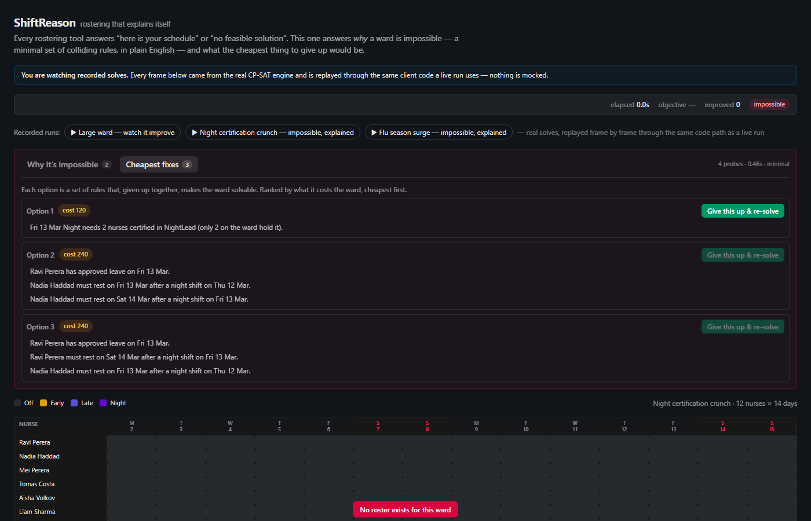
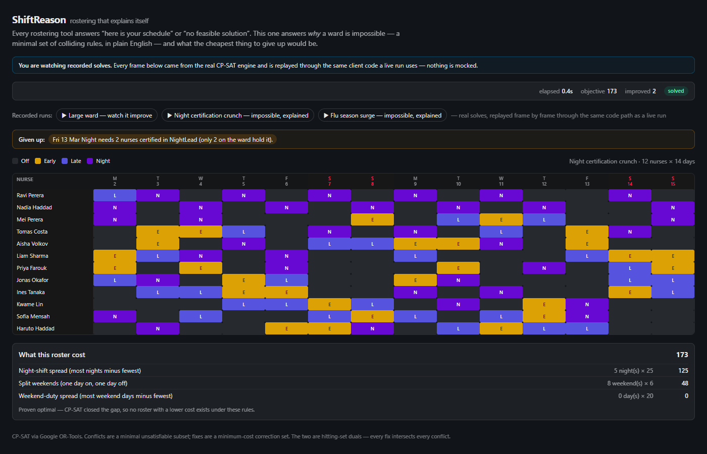
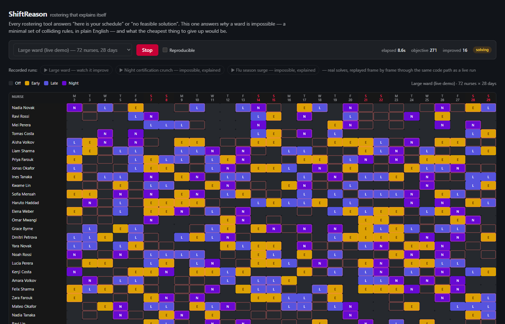

Every rostering tool hits the same wall: when a schedule can't be built, it says
"no feasible solution" and stops. With dozens of overlapping rules — coverage
requirements, certifications, rest periods, leave requests — a manager is left
guessing which one to relax.

ShiftReason answers two questions instead.

## Why is this impossible?

It finds a **minimal set of conflicting rules** — small enough to read in a
sentence, and provably minimal: removing any one rule from the set makes the
rest solvable.

## What's the cheapest fix?

It ranks the rules worth relaxing by cost, and lets you apply one with a click
to re-solve immediately.

The two are mathematical duals of each other — a hitting-set relationship — and
the engine's test suite verifies that relationship holds on every scenario.

## Watching it solve

Solves run against a real constraint solver (CP-SAT via Google OR-Tools) and
stream live over WebSockets as the solution improves. You watch a **72-nurse,
28-day roster** tighten in real time rather than waiting on a spinner.

The live demo needs no backend at all: it replays recorded real solves through
the exact same client code a live connection uses, so the published version is
honest rather than a mockup.

## What it looks like

| Cheapest fixes, ranked by what they cost the ward | Fix applied: solved, and proven optimal |
| --- | --- |
|  |  |

*A 72-nurse, 28-day ward solving live. Improving solutions stream over SignalR, and outlined cells are the ones the latest improvement moved.*

## How it works

Every user-visible rule becomes a **guarded constraint**: it's only enforced
when its own boolean literal is true. That single mechanism, used three ways,
powers the whole product.

- **Optimize** pins every guard on and minimises the soft penalties — this
  produces the roster.
- **Explain** hands the guards to CP-SAT as *assumptions*. When the model is
  infeasible, CP-SAT reports which assumptions it needed to prove that, and
  those are shrunk to a true minimal set by linear deletion.
- **Relax** frees every guard and minimises the business cost of the ones
  switched off — a minimum-cost correction set.

The conflict set and the fixes are **hitting-set duals**: every fix breaks at
least one rule in every conflict, and the test suite asserts exactly that.

A request travels from the React client to a .NET 10 Minimal API, onto a
bounded background queue so a solve never blocks a request thread, into the
CP-SAT model builder, and back out over a SignalR hub as the objective
improves — the same reducer on the client plays both a live connection and a
recorded run, which is what makes the published demo honest rather than a
mockup.

## Technical highlights

- **Constraint solving** — CP-SAT modelled with a "guarded constraint" pattern:
  every rule carries a toggle literal, reused across three solve modes (produce
  a roster, explain infeasibility, find the cheapest fix) from one model
  builder.
- **Backend** — .NET 10 Minimal API, SignalR for live updates, EF Core/SQLite
  for persisted runs, and a background worker queue so solves never block a
  request thread.
- **Frontend** — React and TypeScript, with a single state reducer shared
  between the live WebSocket client and the offline replay player.
- **Infrastructure** — Docker multi-stage build, deployed via Bicep to Azure
  Container Apps (scale-to-zero, OIDC-authenticated CI/CD with no stored
  credentials), static demo on Cloudflare Pages.
- **CI/CD** — GitHub Actions: test, build, smoke-test the container image, then
  deploy both the live app and the static demo automatically on push.
- **Testing** — 58 automated tests across solver correctness, API integration
  and the frontend, plus an end-to-end smoke test run against every deployment.

> The live app scales to zero when idle, so the first load can take up to half a
> minute. The recorded demo starts instantly.
